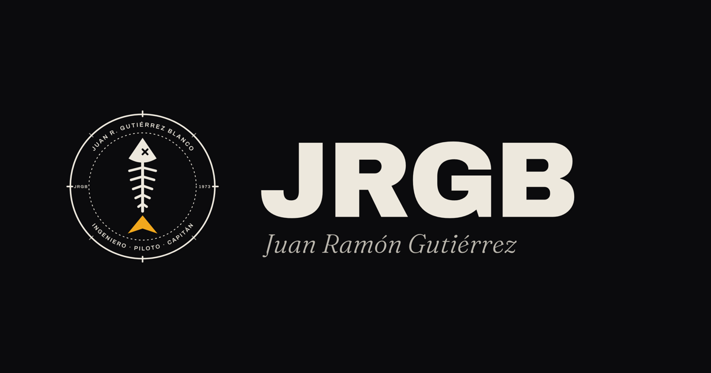
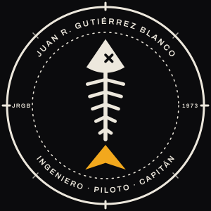
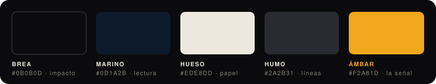
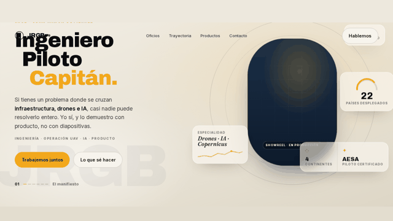

<div align="center">

<a href="https://jrgblanco.com"></a>

<br>

# JRGB · Juan Ramón Gutiérrez

### Ingeniero · Piloto · Capitán

**Infraestructura crítica, drones e IA convertidos en producto.**

<br>

[](https://jrgblanco.com)
[](#historial)
[](#la-web-por-dentro)
[](legal.html)
[](#la-web-por-dentro)

<br>

*Una sola cabeza para lo que normalmente se contrata en tres sitios.*

</div>

<br>

---

## El rumbo

Hay quien sabe de redes, quien sabe volar drones y quien sabe de datos. JRGB junta los tres oficios en una sola persona, y esta web lo cuenta en seis capítulos donde cada bloque responde a una única pregunta: **¿qué te llevas tú?** El currículum solo aparece debajo, como prueba.

| | Capítulo | Qué hace |
|:-:|---|---|
| **01** | Manifiesto | Ingeniero, Piloto, Capitán. Tres palabras y un rumbo. |
| **02** | Tres oficios, una sola cabeza | Infraestructura crítica, operación con drones, datos con IA. |
| **03** | El oficio en movimiento | Showreel con scroll: miles de partículas que se ordenan en «JRGB». |
| **04** | Pruebas | Cinco hechos, cada uno con su «para ti», y las credenciales detrás. |
| **05** | Capacidades y productos | Lo que ya opera y lo que está saliendo. |
| **06** | Contacto | Tres puertas directas a `hablamos@jrgblanco.com`. Sin formularios. |

<div align="center">

**25+** años de oficio &nbsp;·&nbsp; **22** países desplegados &nbsp;·&nbsp; **4** continentes &nbsp;·&nbsp; piloto certificado **AESA**

</div>

---

## El sello



Un **pez espina** que apunta al norte dentro de un instrumento de navegación. Esqueleto, ojo en X pirata y cola ámbar, convertido en la aguja de una brújula.

Precisión, criterio y rumbo, sin una sola palabra.

Alrededor, el anillo lleva el nombre completo arriba, **Ingeniero · Piloto · Capitán** abajo y dos marcas de ceca: **JRGB** a las nueve y **1973** a las tres.

El pez también trabaja suelto: en la web es el botón de volver arriba, y cambia de color según el fondo que tiene debajo.

<br clear="right">

---

## Tres fondos, un pez, una sola señal



| Color | Hex | Para qué |
|---|---|---|
| **Brea** | `#0B0B0D` | Impacto: hero, cierre de vídeo, avatar, favicon. |
| **Marino** | `#0D1A2B` | Lectura larga: secciones, slides, dashboards. |
| **Hueso** | `#EDE8DD` | Papel: propuestas, PDF, facturas. |
| **Ámbar** | `#F2A81D` | El único acento. Nunca más del 5 % de la pantalla. |

> **La regla:** un solo acento por pantalla. El ámbar es una señal, no una decoración.

### Tipografía

| Familia | Papel |
|---|---|
| **Archivo** 600–900 | Titulares y wordmark, con tracking negativo. |
| ***Fraunces*** itálica | La capa humana: los acentos que suenan a voz. |
| **Inter** | El cuerpo de texto. |

Todas las transiciones usan una sola curva: `cubic-bezier(.22, 1, .36, 1)`.

---

## La web por dentro

**HTML, CSS y JavaScript a mano, en un solo fichero.** Sin framework, sin bundler, sin `node_modules`. Lo que ves en el repo es exactamente lo que sirve el servidor.

<table>
<tr>
<td width="50%" valign="top">

### Rápida
- Fuentes **autoalojadas** en WOFF2 variable, subconjuntadas a latín: **193 KB** entre las tres.
- `preload` de Archivo e Inter y `font-display: swap`: el texto no salta al cargar.
- Brotli en el servidor y caché inmutable para las fuentes.

</td>
<td width="50%" valign="top">

### Honesta
- **Cero cookies y cero formularios.**
- **Cero peticiones a terceros:** ni Google Fonts, ni analítica, ni CDNs.
- [Aviso legal y privacidad](legal.html) escritos para leerse.

</td>
</tr>
<tr>
<td width="50%" valign="top">

### Viva
- **Showreel de partículas:** unos 3.000 puntos en un `<canvas>` se agrupan en «JRGB» con el scroll, dan una vuelta en 3D y se quedan en trama con un latido ámbar.
- Dibujo por lotes con `Path2D`, sin librerías.

</td>
<td width="50%" valign="top">

### Cuidadosa
- Respeta `prefers-reduced-motion`: sin movimiento, las partículas se pintan ya ordenadas.
- Tarjeta de previsualización Open Graph completa para WhatsApp y LinkedIn.
- Datos estructurados `Person` en JSON-LD.

</td>
</tr>
</table>

<div align="center">

<br><sub>El showreel, mientras llega el vídeo de verdad.</sub>
</div>

---

## Estructura

```
.
├── index.html            la web entera: marcado, estilos y scripts
├── legal.html            aviso legal LSSI y privacidad
├── fonts/
│   ├── archivo.woff2         display  · wght 600–900
│   ├── fraunces-italic.woff2 acentos  · wght 400–600
│   └── inter.woff2           cuerpo   · wght 400–700
├── og.png                tarjeta para redes, 1200 × 630
├── favicon.ico
├── jrgb-favicon-180.png  apple-touch-icon
├── jrgb-icono-brea.svg   el sello
├── capturas/             el showreel y el pez de volver arriba
├── docker-compose.yml    el contenedor nginx alpine que la sirve
├── nginx.conf            caché por tipo de fichero y /health
└── DESPLIEGUE.md         runbook: DNS, nginx, TLS y verificación
```

---

## Verla en local

No hay nada que instalar:

```bash
python3 -m http.server 8000
```

Y abrir <http://localhost:8000>.

## Desplegar

La web es estática y vive en un contenedor **nginx alpine** (`docker compose up -d`, solo en `127.0.0.1`) detrás del nginx de un VPS Ubuntu, con TLS de Let's Encrypt, Brotli y cabeceras de seguridad (HSTS, `nosniff`, `Referrer-Policy`, `Permissions-Policy`). El paso a paso completo, con la verificación posterior que no se salta nunca, está en **[DESPLIEGUE.md](DESPLIEGUE.md)**.

---

## En el horizonte

- [ ] El vídeo de verdad en el hero y en el showreel, en lugar de las partículas.
- [ ] WhatsApp como cuarta puerta de contacto.
- [ ] «El cruce»: los tres oficios en un diagrama animado en SVG.
- [ ] Foto y testimonio.
- [ ] Analítica sin cookies.

## Historial

| Versión | Qué trajo |
|---|---|
| **7.2** | Fuentes autoalojadas, showreel de partículas, pez de volver arriba, aviso legal, correo del dominio, cabeceras de seguridad y tarjeta Open Graph completa. En producción desde el 26-09-2026. |
| **7.1** | Estructura de seis capítulos y la regla del «qué te llevas tú». |
| **6** | Primera versión con el sistema de marca Aguja. |

---

<div align="center">


**[jrgblanco.com](https://jrgblanco.com)** &nbsp;·&nbsp; **[hablamos@jrgblanco.com](mailto:hablamos@jrgblanco.com)**

<sub>© Juan Ramón Gutiérrez Blanco. El código de este repositorio se puede consultar; el sello, el nombre y los contenidos son marca y obra suyas y no se pueden reutilizar.</sub>

</div>
